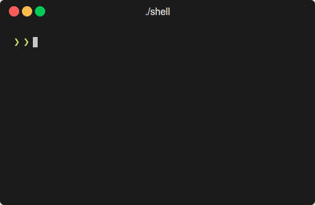

# Basic Unix Shell

<p align="center">
  
</p>

This project implements a minimalist Unix-like shell in C, offering basic functionality for executing commands with support for I/O redirection, environment customization, built-in commands, and signal handling.

## Features

- **I/O Redirection:** Supports `<`, `>`, `>>`, `2>`, and `&>` for redirecting standard input, output, error streams, and appending to files. Redirection symbols should be surrounded by whitespace.
- **Environment Customization:** Uses a customizable prompt string, which defaults to a simple format but can be overridden by the `PS1` environment variable.
- **Built-in Commands:** Includes basic navigation via `cd` and exiting the shell using `exit`.
- **Shell Variable `$?`:** Captures the exit status of the last executed command or the signal number (with bit 7 set) if terminated due to a signal.
- **Signal Handling:** Ignores `^C` (SIGINT) at the shell level, allowing interruption of child processes without exiting the shell.

## Limitations

While this shell implementation provides a basic set of features, it has several limitations:

- **Limited Built-in Commands:** Only supports a minimal set of built-in commands (`cd` and `exit`). Advanced shell functionalities like `pushd`, `popd`, `dirs`, and job control are not supported.
- **No Scripting Support:** Lacks support for shell scripting, including control flow statements (`if`, `while`, `for`), script execution, and function definitions.
- **No Command History:** Does not maintain a history of executed commands, thus cannot navigate through previous commands using the up and down arrow keys.
- **No Tab Completion:** Lacks tab completion for commands and file paths, a feature commonly found in more sophisticated shells.
- **No Alias Support:** Does not support command aliases, a feature that allows users to define shortcuts for long commands or command sequences.
- **No Job Control:** Lacks job control features, which allow users to suspend and resume processes, bring background processes to the foreground, and manage multiple processes more easily.


## Prerequisites

Before building the shell, ensure you have GCC installed on your system as the compilation depends on it.

## Building the Shell

The project includes a Makefile for easy compilation. Simply run the following command in the terminal within the project directory:

```bash
make
```
This will compile the source code into an executable named `shell`.